# Фреймворк Django

**Содержание**

[Первое Знакомство с Django](#первое-знакомство-с-django) 
[Django ORM и связи](#django-orm-и-связи) 
[Шаблоны](#шаблоны) 
[Классы и формы](#классы-и-формы)

## Первое Знакомство с Django

Создайте пару представлений в вашем первом приложении:
- главная
- о себе.

Внутри каждого представления должна быть переменная html — многострочный текст с 
HTML-вёрсткой и данными о вашем первом Django-сайте и о вас.

Сохраняйте в логи данные о посещении страниц.

**Пример выполнения**

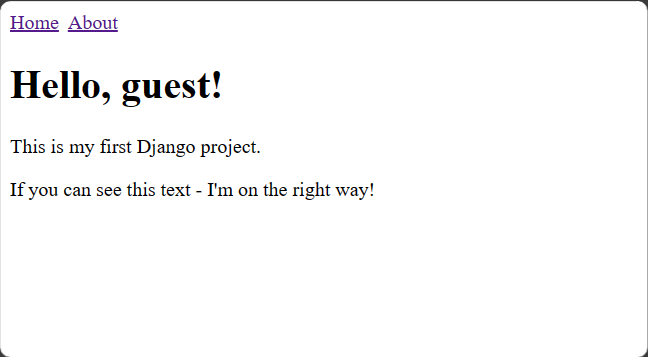

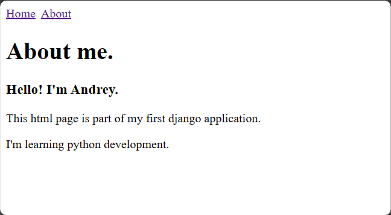

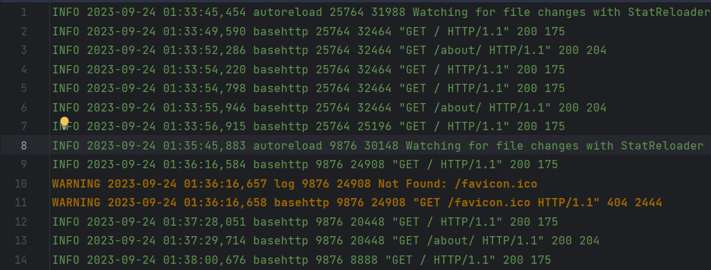

## Django ORM и связи

Создайте три модели Django: клиент, товар и заказ.

Клиент может иметь несколько заказов. Заказ может содержать несколько товаров. Товар может входить в несколько заказов.

Поля модели «Клиент»:
- имя клиента
- электронная почта клиента
- номер телефона клиента
- адрес клиента
- дата регистрации клиента

Поля модели «Товар»:
- название товара
- описание товара
- цена товара
- количество товара
- дата добавления товара

Поля модели «Заказ»:
- связь с моделью «Клиент», указывает на клиента, сделавшего заказ
- связь с моделью «Товар», указывает на товары, входящие в заказ
- общая сумма заказа
- дата оформления заказа

Допишите несколько функций CRUD для работы с моделями по желанию. Что по вашему мнению актуально.

**Пример выполнения**

Заполнение БД

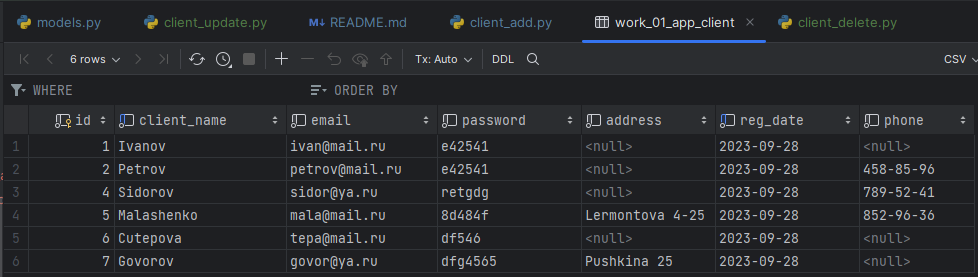

Вывод данных в представлении, по умолчанию упорядочены по алфавиту

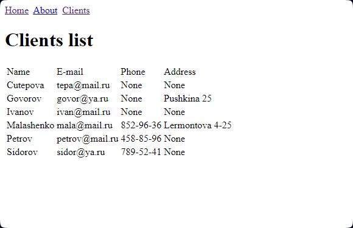

## Шаблоны

Продолжаем работать с товарами и заказами.

Создайте шаблон, который выводит список заказанных клиентом товаров из всех его заказов с сортировкой по времени:
- за последние 7 дней (неделю)
- за последние 30 дней (месяц)
- за последние 365 дней (год)

Товары в списке не должны повторятся.

**Пример выполнения**

Список клиентов магазина 

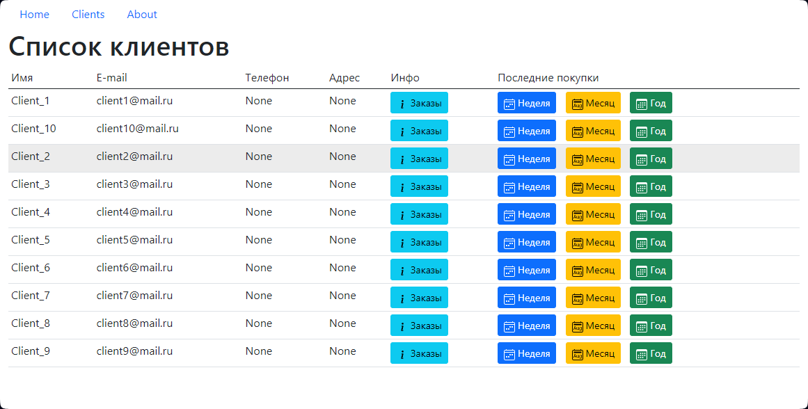

Список заказов по клиенту

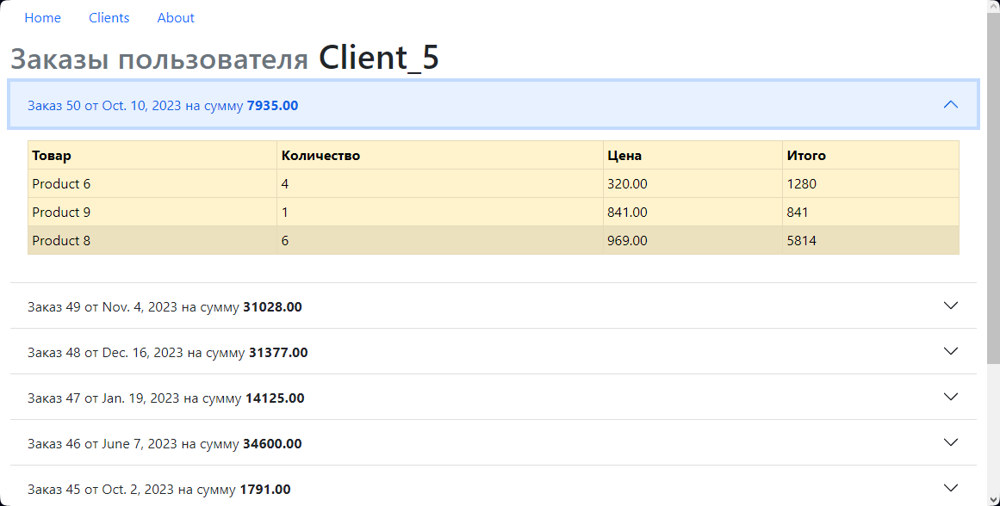

Последние покупки

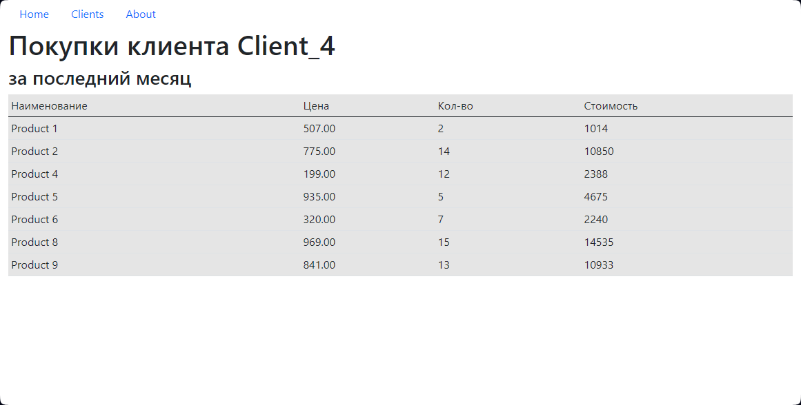

## Классы и формы

Измените модель продукта, добавьте поле для хранения фотографии продукта.

Создайте форму, которая позволит сохранять фото.

**Пример выполнения**

Список товаров магазина

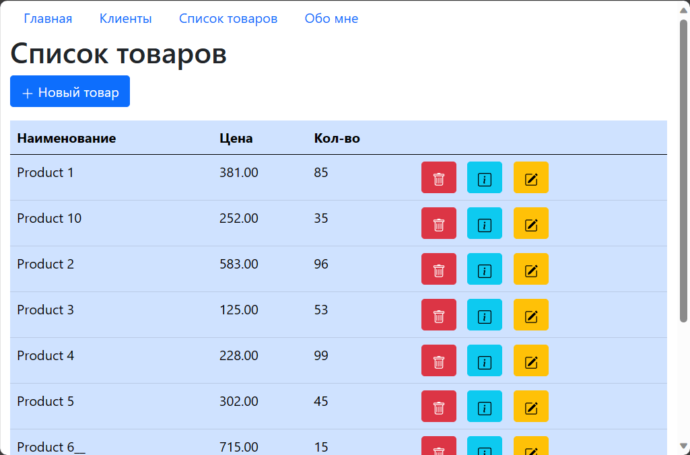

Форма создания нового продукта

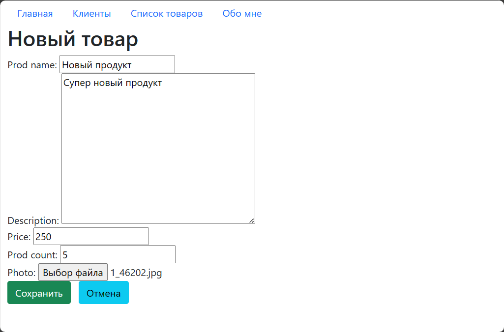

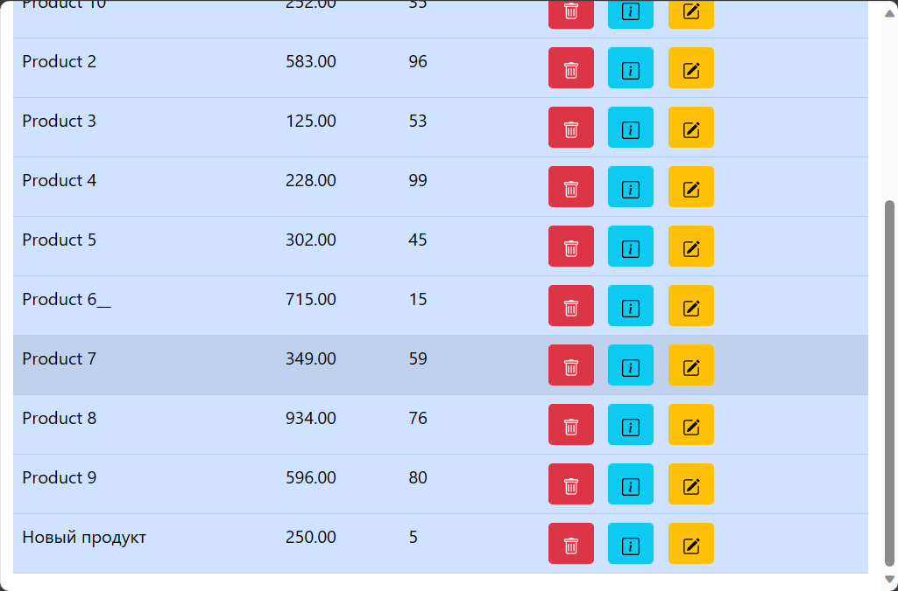

Измение товара

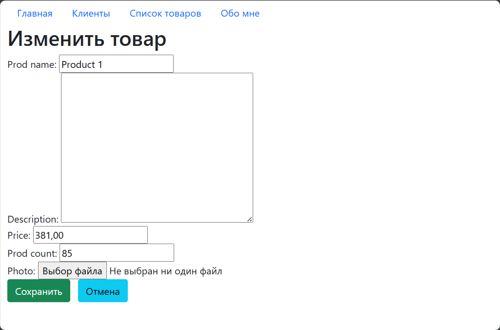

